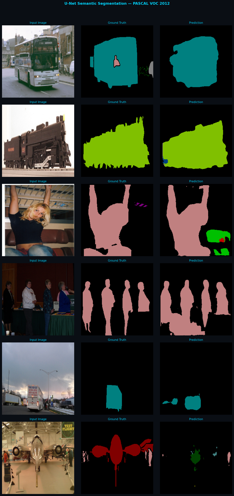
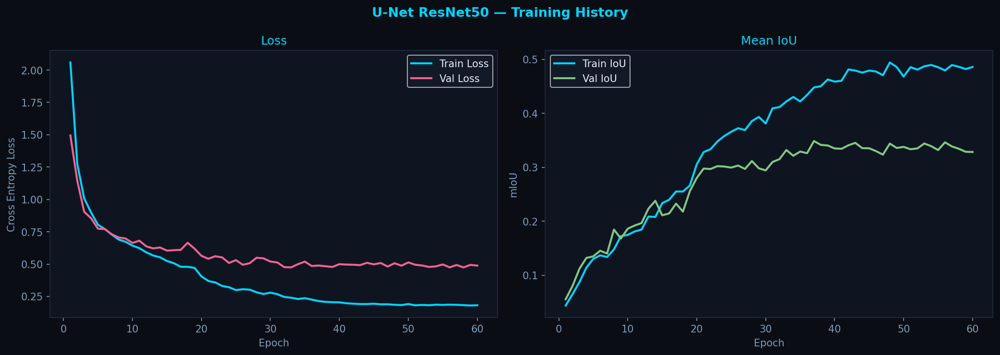
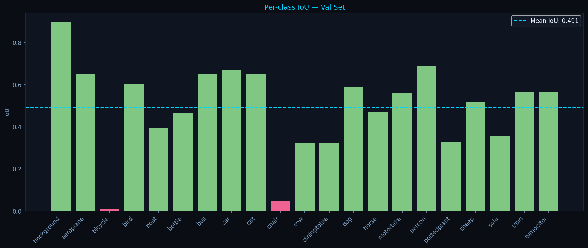

# U-Net Semantic Segmentation — PASCAL VOC 2012

Semantic segmentation from scratch in PyTorch — every pixel classified into one of 21 categories. Built with a custom U-Net architecture and progressively improved with a pretrained ResNet50 encoder via transfer learning.

---

## Results

### Predictions — ResNet50 Encoder



### Training History



### Per-Class IoU



---

## Performance Summary

| Model | Val mIoU | Epochs |
|-------|----------|--------|
| U-Net from scratch | 0.1272 | 50 |
| U-Net from scratch + augmentation | 0.1360 | 100 |
| U-Net + ResNet50 pretrained | **0.3478** | 60 |
| Per-class evaluation (best model) | **0.491** | — |

> Note: The per-class mean IoU (0.491) is computed per-image across the full validation set, which differs slightly from the epoch-level mIoU (0.3478) logged during training.

---

## Architecture

```
Input (3×256×256)
    │
    ├── Encoder Block 1 (64)  ──────────────────────────┐ skip
    ├── Encoder Block 2 (128) ───────────────────────┐  │ skip  
    ├── Encoder Block 3 (256) ────────────────────┐  │  │ skip
    ├── Encoder Block 4 (512) ─────────────────┐  │  │  │ skip
    │                                          │  │  │  │
    └── Bottleneck (1024)                      │  │  │  │
            │                                  │  │  │  │
    ┌── Decoder Block 4 ◄── concat ────────────┘  │  │  │
    ├── Decoder Block 3 ◄── concat ───────────────┘  │  │
    ├── Decoder Block 2 ◄── concat ──────────────────┘  │
    └── Decoder Block 1 ◄── concat ─────────────────────┘
            │
    Output (21×256×256) — one score per class per pixel
```

Each encoder block: `Conv2d → BatchNorm → ReLU → Conv2d → BatchNorm → ReLU → MaxPool`

Each decoder block: `ConvTranspose2d (upsample) → concat skip → DoubleConv`

---

## Dataset

**PASCAL VOC 2012** — 21 classes, 1464 training images, 1449 validation images.

| Metric | Value |
|--------|-------|
| Classes | 21 (background + 20 objects) |
| Train samples | 1245 (after 85/15 split) |
| Val samples | 219 |
| Image size | 256 × 256 |
| Normalization | ImageNet mean/std |

---

## Key Findings

**Best classes** — background (0.896), person (0.688), car (0.668), bus (0.651)

**Worst classes** — bicycle (0.008), chair (0.048)

Bicycle and chair fail because both are structurally transparent objects — background is visible through spokes and chair legs. The model sees mostly background and misclassifies the thin structural elements. This is a known challenge in semantic segmentation requiring higher resolution or specialized loss functions.

**Transfer learning impact** — switching from a randomly initialized encoder to a ResNet50 pretrained on ImageNet jumped mIoU from 0.127 to 0.348 — nearly 3x improvement. The pretrained encoder already understands textures, edges and object parts from 1.2M ImageNet images, leaving only segmentation-specific decoding to learn.

---

## Training

```bash
python src/train.py
```

Default: 60 epochs, batch size 8, lr=1e-4, ResNet50 encoder with ImageNet weights.

---

## Visualization

```bash
python src/visualize.py       # prediction grid vs ground truth
python -m src.utils           # training curves + per-class IoU
```

---

## Project Structure

```
unet-semantic-segmentation/
├── src/
│   ├── unet.py         # custom U-Net architecture from scratch
│   ├── dataset.py      # VOC dataset wrapper with augmentation
│   ├── train.py        # training loop with IoU metric
│   ├── visualize.py    # prediction visualization
│   └── utils.py        # training curves + per-class IoU analysis
├── docs/
│   ├── predictions.png          # ResNet50 model predictions
│   ├── predictions_50ep.png     # scratch model predictions (baseline)
│   ├── training_curves.png      # loss and IoU over epochs
│   └── per_class_iou.png        # per-class breakdown
└── data/                        # PASCAL VOC 2012 (auto-downloaded, not tracked)
```

---

## Known Limitations

- Thin/complex objects (bicycle, chair) are poorly segmented — requires higher input resolution or specialized loss
- Some overfitting after epoch 35 — gap between train IoU (0.49) and val IoU (0.35) suggests more aggressive augmentation or dropout would help
- 256×256 resolution loses fine detail — standard papers use 512×512 or higher

---

## Author
Nassib El Saghir — [LinkedIn](https://linkedin.com/in/nassib-el-saghir) — [GitHub](https://github.com/nassib-es)